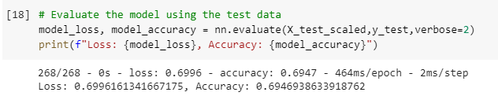
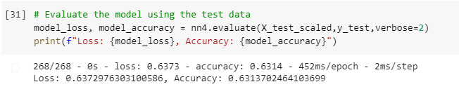

# Neural Network Charity Analysis

## Overview

The purpose of this analysis was to use neural networks to predict whether an organization funded by Alphabet Soup used the provided money effectively based on various factors.

## Results

### Data Preprocessing

- The target for the models used in this analysis was the "IS_SUCCESSFUL" field, i.e. whether or not the organization succeeded
- The features for the models were the fields that provided info about the various factors that could lead to an organizations success, e.g. government organization classification and application type
- Name and EIN were neither targets nor features and were removed from the input data

### Compiling, Training, and Evaluating the Model

For the initial model, two hidden layers (one with 8 neurons, one with 5 neurons) and the ReLU activation function were used. These were chosen as they were values used in previous models involving datasets of a similar size.

**Performance of original model**

The original model had an accuracy of 0.47, which leaves room for improvement.

**Performance after first optimization attempt**

The first attempt to optimize the model involved raising the number of nodes in each hidden layer to 10 (up from 5 and 8). This raised the accuracy of the model to 0.69, a demonstrable improvement.

**Performance after second optimization attempt**

In my second attempt to optimize the model, I added a third hidden layer with 5 neurons, resulting in hidden layers with 8, 5, and 5 neurons in total. The performance went up from the original model to 0.53, but not as much as during the first optimization attempt. This indicates that increasing the number of neurons may be generally more effective at increasing accuracy.

**Performance after third optimization attempt**

Thirdly, I tried to optimize the model by using a Leaky ReLU activation function instead of a ReLU activation function. This raised accuracy to 0.68, about the same increase as in the first attempt.

**Performance after fourth optimization attempt**

In the first three optimization attempts, I only made one change relative to the original model. Since the first and third attempts had similar results, I tried combining them and using two hidden layers with 10 neurons each and a Leaky ReLU activation function to see if these two changes would compound. The result was an accuracy of 0.63, showing that adjustments to a model that increased accuracy individually will not always work together to further increase accuracy if implemented simultaneously. The AlphabetSoupCharity_Optimization.h5 file included in this analysis is from this model.

## Summary

Overall, the deep learning model used in this analysis showed that it was capable of somewhat accurately predicting the success of an organization funded by Alphabet Soup, but some further adjustments should be made before it can be considered reliable. Additional adjustments not used in this analysis could be playing with the number of epochs, either increasing to test whether the model isn't trained enough or decreasing to see if the model is overtrained. Combinations of multiple adjustments beyond the one used in my fourth optimization attempt would also likely provide more insight into the best way to optimize this model.
